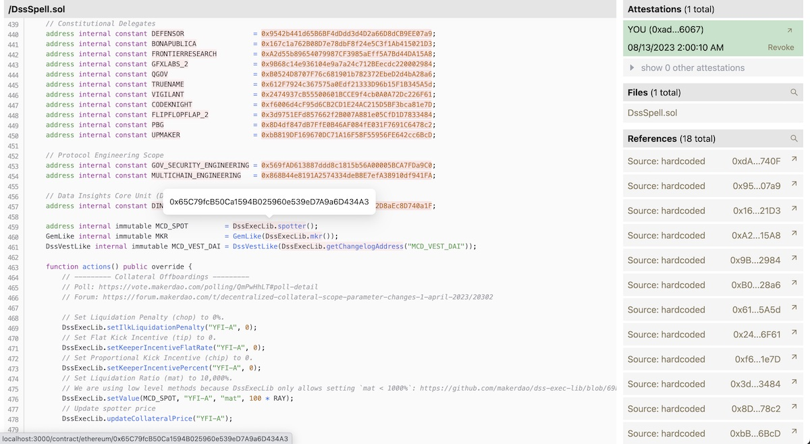

# Chain Reviewer

The Missing Toolchain to Review and Attest Deployed Contracts for Op-Stack Developers

## Getting Started

1. Install dependencies and apply database schema
```bash
cd app \
&& npm install \
&& cp .env.example .env \
&& npx prisma db push
```
2. open `.env` file with your preffered editor and populate the missing values.
   - see the [corresponding section](./README.md#environment-variables) for configuration of these keys

4. Run the development server.
```bash
npm run dev
```

Open [http://localhost:3000](http://localhost:3000) with your browser to see the result.

## Environment variables

You can see all the environment variables in`.env.example`.
You can copy this file to create `.env`:

```bash
cp .env.example .env
```

### Etherscan API call

To use etherscan/optimism etherscan API call, you need to add api keys to `.env` file.
`ETHERSCAN_API_KEY`: to search for `mainnet`, `mainnet-georli`, `mainnet-sapolia`,
`ETHERSCAN_API_KEY_OPTIMISM`: to search for `optimism`
We only support chains specified above for now.

### Database

For development, we use `SQLite + prisma ORM`.
To setup database locally, please manually add `DATABASE_URL` to `.env` or copy the `.env.example` file.

```bash
# to create database locally
npx prisma db push

# to check database state
npx prisma studio

# to format schema.prisma file
npx prisma format
```
